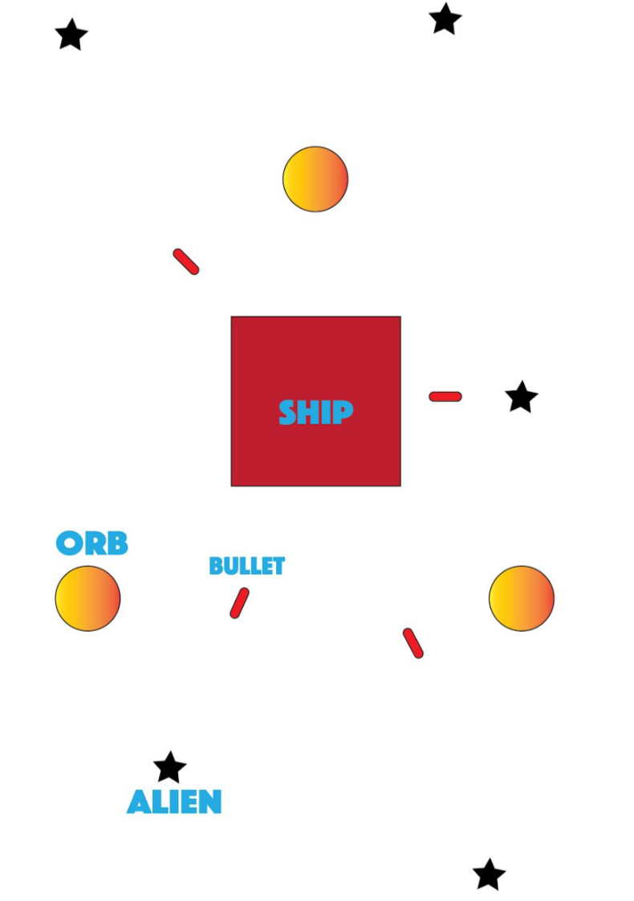

# GALAXY DEFENDER 3000 - Swift

## Final Demo

## Design Goal: 
This game has 3 special features, but an instruction guide would be too tedious for users.
My goal was to make the features intuitive and easily learnable as users played.

The features were: 
 - Clicking further away from the ship makes the bullets travel faster (learned through trial and error)
 - Force fields on the protected asteroids (intuitive by design of force fields) 
 - Freezing bullets when ship is hit (intuitive by design of frozen ship and learned by inability to shoot bullets)
 
This goal was achieved. Test users immediately understood the blue force-field rings and the frozen-ship symbols and learned how the bullets worked almost instantly. 

## First draft of Design Spec

